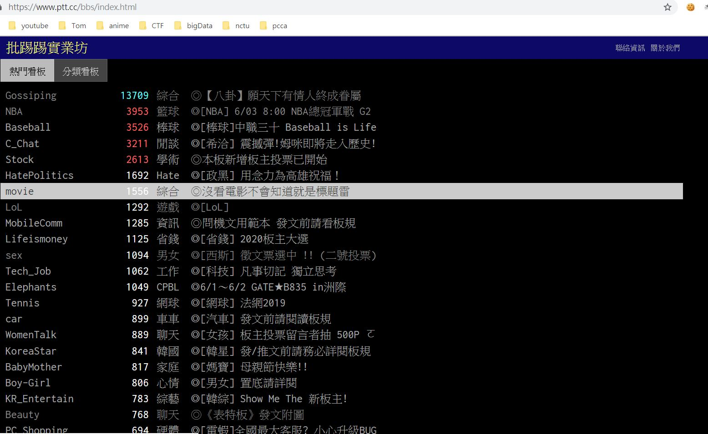
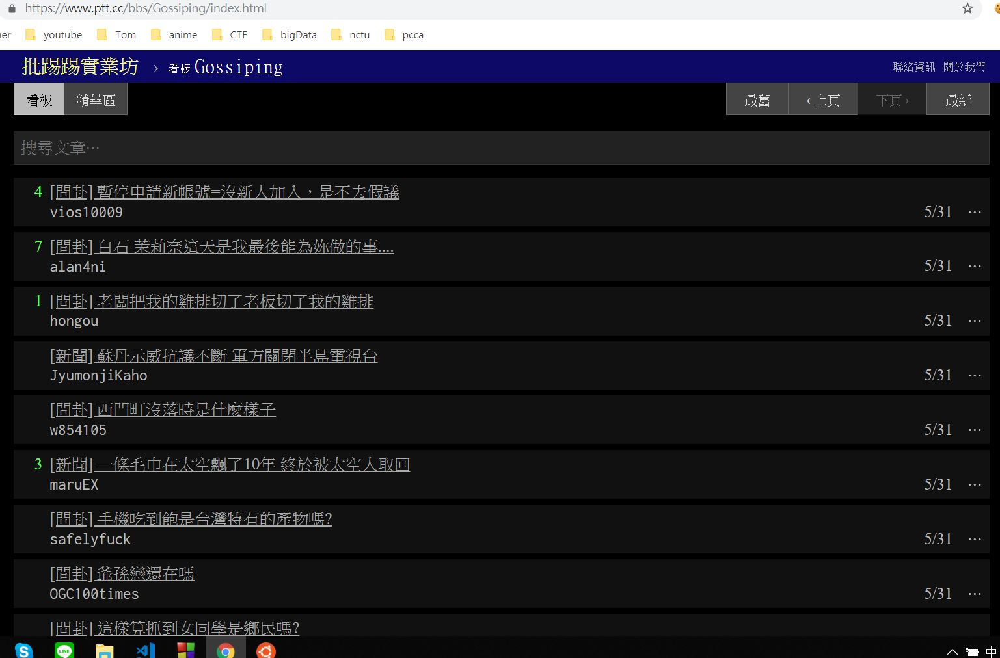
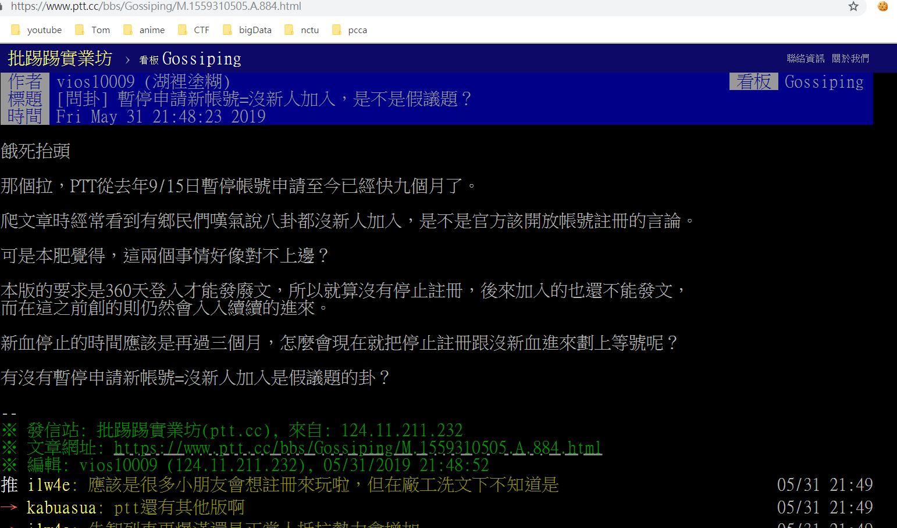
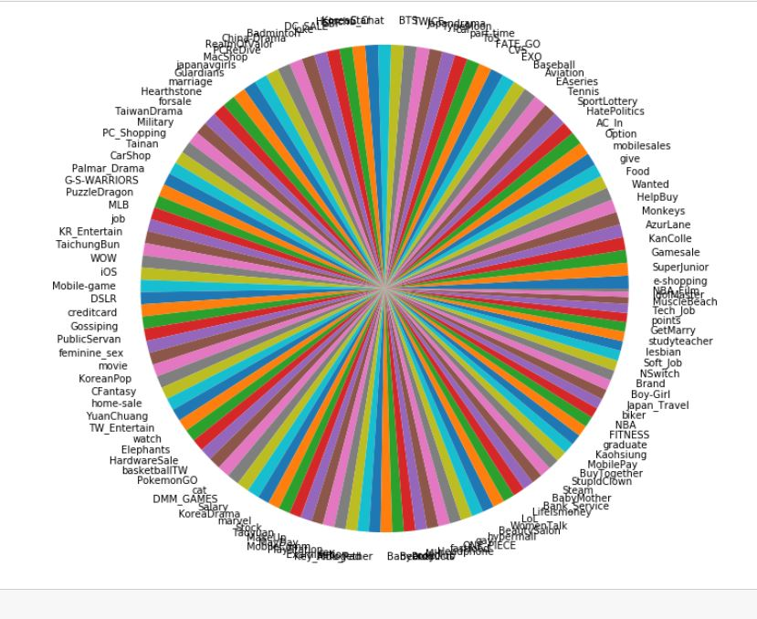

# 爬蟲 
## 實作過程
1. 到 ptt 看板把取得所有分類的連結

2. 從所有分類的連結取得該分類的某一頁的連結

3. 從某一頁取得文章連結

4. 取得文章後，對它做處理，把標點符號、英文字母、特殊字元去掉
5. 分成兩種，一種是一個字一個字分開的，另一種是有用 jieba 判斷過字詞的
6. 最後存到 csv 檔中

## 實作心得
一開始就打算用 bs4 來實作爬蟲的部分。但是後來發現，在抓資料時還是會遇到一些例外發生，所以又要多很多判定去做例外處理。後來又發現如果把抓的資料全部都存在同一個 csv 檔案中會因為太大而沒有辦法上傳到 github，因此又要分好幾個檔案來存。之後在實作模型時，發現用原本的方法(一個字、兩個字、三個字、四個字)來處理的話，陣列會開太大而導致 memory error，所以後來就改成只切一個字。然而這樣準確率又太低，因此最後 google 到 jieba，它可以把一句中文分成很多的有意義的字詞。

# 模型 train
## 實作過程
1. 利用 matplotlib 畫出每個分類的圓餅圖

2. 利用 label encoder 和 CountVectorizer 對 文章分類和文章字詞做前置處理
3. 把 trainging data 餵進去 Bayes GaussianNB 訓練，之後再預測 testing data
4. 最後取得準確率和 confusion matrix

## 實作心得
這部分除了遇到在爬蟲中的 memory error 之外做得都還算順利，基本上就套用之前作業寫過的部分依樣畫葫蘆就完成了。