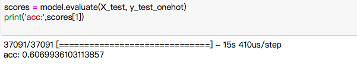
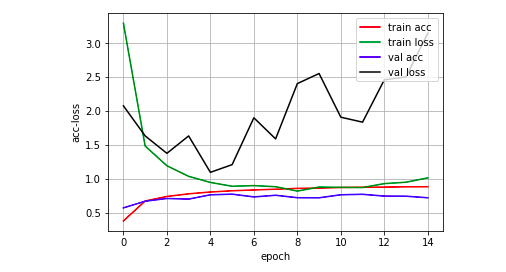
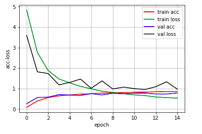
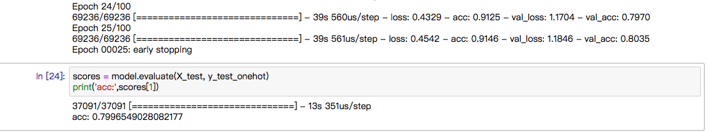

# Data-Preprossessing

爬下來的資料共12萬多筆，超過github個別檔案容量限制，因此分裝成25個csv檔，使用pandas read_csv+tips from stackoverflow讀入分裝的資料。
使用CountVectorizer統計字詞頻率，LabelEncoder將target編碼，於nn-model 再使用one_hot_encoding將target編碼。
以test_size=0.3的比例，分成training data 86k 筆，testing data 37k 筆。

# nn-analysis

這個模組很有趣，有很多參數可以調整，每次都好像發現新大陸！
發現hidden layer設個10層 unit 1000，fit了一個多小時，還沒有結果。
發現dropout，好像對準確率提升沒什麼幫助。
epoch設定太少會過早結束，使得原本可以再更高的準確率沒那麼高。但epoch設定太多則會有overfitting的問題，準確率反而會下降。使用early_stopping這個callback function來解決頻繁調epoch的困擾。

patience 設定為10，造成overfitting，將patience下調為3，結果：

